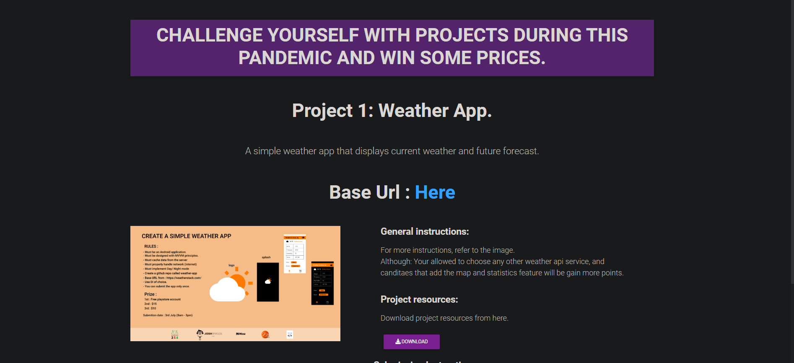

# landing-page

## About
A simple website to showcase monthly android project challenges, that any one can participate in. Find the heroku link here.
- [Practice android here](https://afternoon-peak-96228.herokuapp.com/) - Share or try your luck.
## Built With 🛠
- [NodeJS](https://nodejs.org/en/about/) -An asynchronous event-driven JavaScript runtime, Node.js is designed to build scalable network applications. .
- [ExpressJS](https://expressjs.com/) -Express is a minimal and flexible Node.js web application framework that provides a robust set of features for web and mobile applications. 
- [MongoDB / MLAB](https://mlab.com/) -Now part of the MongoDB family, powering over 1 million deployments worldwide. 
- [EJS](https://ejs.co/) -EJS is a simple templating language that lets you generate HTML markup with plain JavaScript. No religiousness about how to organize things. No reinvention of iteration and control-flow. It's just plain JavaScript. 
- [Heroku](https://dashboard.heroku.com/apps) -Heroku is a platform as a service (PaaS) that enables developers to build, run, and operate applications entirely in the cloud. 

## TODO
- Buy domain name from name cheap.
- pay for hobby hosting oon heroku
- Add a new letter feature
- Add the second project.

## Credit
- [Joshua Murigi](https://github.com/ryggs) - Software Developer, Graphics Designer, Entrepreneure
- [Bill Odida]() - Software Developer, Social Media Influencer
- [Maku Pauline Mazakpe]() - Software Developer

## Contact
If you need any help, you can connect with me.

Visit:- [maku](https://www.linkedin.com/in/maku-mazakpe-700a3a165/)

